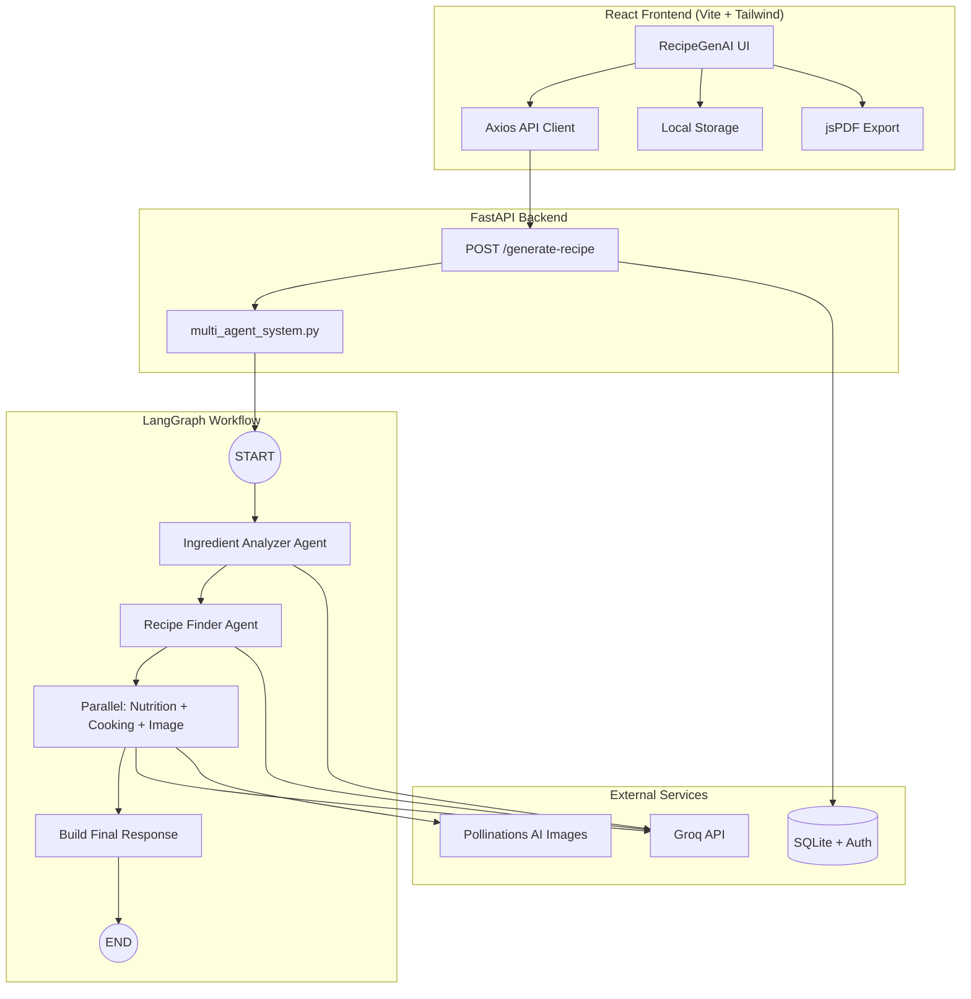

# RecipeGenAI — Multi-Agent Recipe Recommendation System

A production-ready, end-to-end AI application where **4 specialized agents** collaborate via **LangGraph** to generate personalized recipes from your available ingredients and preferences.


> Replace the placeholder above with a screenshot after running the app.

---

## Project Overview

RecipeGenAI accepts user ingredients, cuisine preference, dietary restrictions, and cooking time — then orchestrates a sequential multi-agent pipeline powered by **Groq** to deliver:

- Personalized recipe recommendation
- Full ingredients list and missing ingredients
- Nutrition estimates (calories, protein, carbs, fat)
- Step-by-step cooking instructions
- Cooking tips and serving suggestions
- Shopping list and ingredient substitution suggestions
- **AI-generated recipe images**
- **English & Kannada** multi-language support
- **User authentication** with JWT
- **Agent memory** for personalized preferences
- **Parallel agent execution** for faster responses
- **Voice input** for ingredients (browser Web Speech API)

---

## Architecture



---

## Multi-Agent Workflow

| Agent | Responsibility | Input | Output |
|-------|---------------|-------|--------|
| **1. Ingredient Analyzer** | Analyze ingredients, categories, recipe opportunities | `ingredients` | `ingredient_analysis` |
| **2. Recipe Finder** | Match cuisine/diet, select best recipe, find missing items | `ingredient_analysis` | `recipe_name`, `required_ingredients`, `missing_ingredients` |
| **3. Nutrition Agent** | Estimate macros and calories | Recipe data | `nutrition` |
| **4. Cooking Instruction** | Generate steps, tips, serving ideas | Recipe data | `instructions`, `tips`, `serving_suggestions` |
| **5. Image Generation** | Generate recipe food photo URL | Recipe name + cuisine | `image_url` |

Agents 3–5 run **in parallel** after Recipe Finder for faster responses.
All agents share a common **`RecipeState`** TypedDict managed by LangGraph `StateGraph`.

---

## Tech Stack

| Layer | Technologies |
|-------|-------------|
| **AI / Orchestration** | LangChain, LangGraph, Groq |
| **Backend** | Python, FastAPI, Pydantic, Uvicorn |
| **Frontend** | React, Vite, Axios, Tailwind CSS |
| **Auth** | JWT, bcrypt, SQLite |
| **Bonus** | LocalStorage, jsPDF, Web Speech API, i18n (en/kn) |

---

## Project Structure

```
Recipe-Multi-Agent/
├── README.md
├── backend/
│   ├── app.py                    # FastAPI application
│   ├── multi_agent_system.py     # Complete LangGraph implementation
│   ├── requirements.txt
│   ├── .env.example
│   └── README.md
└── frontend/
    ├── src/
    │   ├── components/           # UI components
    │   ├── pages/                # Page views
    │   ├── services/             # API, storage, PDF
    │   └── App.jsx
    ├── package.json
    ├── .env.example
    └── README.md
```

---

## Installation

### Prerequisites

- Python 3.10+
- Node.js 18+
- Groq API key ([Get one here](https://console.groq.com/keys))

### Backend Setup

```bash
cd backend
python -m venv venv
source venv/bin/activate        # Windows: venv\Scripts\activate
pip install -r requirements.txt
cp .env.example .env
```

Edit `.env` and set your API key:

```env
GROQ_API_KEY=your_groq_api_key_here
GROQ_MODEL=llama-3.3-70b-versatile
```

### Frontend Setup

```bash
cd frontend
npm install
cp .env.example .env              # optional
```

---

## Environment Variables

### Backend (`backend/.env`)

| Variable | Required | Description |
|----------|----------|-------------|
| `GROQ_API_KEY` | Yes | Groq API key |
| `GROQ_MODEL` | No | Model name (default: `llama-3.3-70b-versatile`) |
| `JWT_SECRET_KEY` | Yes (prod) | Secret for signing auth tokens |
| `JWT_EXPIRE_MINUTES` | No | Token expiry (default: `10080`) |

### Frontend (`frontend/.env`)

| Variable | Required | Description |
|----------|----------|-------------|
| `VITE_API_URL` | No | Backend URL (default: `http://localhost:8000`) |

---

## Running the Application

### Start Backend

```bash
cd backend
source venv/bin/activate
python app.py
```

API: `http://localhost:8000` | Docs: `http://localhost:8000/docs`

### Start Frontend

```bash
cd frontend
npm run dev
```

App: `http://localhost:5173`

### CLI Mode (Assignment Requirement)

```bash
cd backend
python multi_agent_system.py
```

Interactive prompts for ingredients, cuisine, diet, and cooking time.

---

## API Reference

### `POST /generate-recipe`

**Request:**

```json
{
  "ingredients": "tomato,onion,paneer",
  "cuisine": "Indian",
  "diet": "Vegetarian",
  "cooking_time": "30"
}
```

**Response:**

```json
{
  "recipe_name": "Paneer Tikka Masala",
  "description": "...",
  "ingredients": ["..."],
  "missing_ingredients": ["..."],
  "missing_ingredient_suggestions": ["..."],
  "shopping_list": ["..."],
  "nutrition": {
    "calories": 350,
    "protein": 18,
    "carbs": 25,
    "fat": 20
  },
  "instructions": ["..."],
  "tips": ["..."],
  "serving_suggestions": ["..."]
}
```

---

## Bonus Features

| Feature | Implementation |
|---------|---------------|
| Missing Ingredient Suggestions | Recipe Finder Agent + UI display |
| Shopping List Generation | Recipe Finder Agent + dedicated UI section |
| Save Recipe | LocalStorage persistence |
| Recipe History | LocalStorage with history tab |
| Download PDF | jsPDF client-side export |

---

## Screenshots

| Home | Recipe Result | Nutrition |
|------|--------------|-----------|
|  |  |  |

---

## New Features (v2.0)

| Feature | How to use |
|---------|-----------|
| **User Auth** | Click Login → Register/Login. Enables agent memory. |
| **Agent Memory** | Logged-in users get personalized recipes based on past preferences. |
| **Image Generation** | Auto-generated food photo shown with each recipe. |
| **Voice Input** | Click 🎤 on ingredients field (Chrome/Edge recommended). |
| **Multi-language** | Select English or ಕನ್ನಡ in the form — recipe content is generated in that language. |
| **Parallel Agents** | Nutrition + Cooking + Image run simultaneously after Recipe Finder. |

### Auth API

| Method | Path | Description |
|--------|------|-------------|
| POST | `/auth/register` | Create account |
| POST | `/auth/login` | Get JWT token |
| GET | `/auth/me` | Current user (requires token) |
| GET | `/auth/memory` | User preference memory (requires token) |

## Future Enhancements

- Cloud recipe storage
- Ingredient barcode scanning
- Meal planning calendar
- Grocery delivery API integration
- Recipe rating and feedback loop

---

## License

MIT — Built for academic assignment and production demonstration purposes.
